# Depiction of Juju Lifecycle Events
This repository includes PlantUML files that can be used to generate the sequence of lifecycle events that are triggered as a result of some user commands entered via the Juju client, e.g. deploy. Note that the repository also includes the output "png" files. 

The following are covered:

1. deploy - Command to deploy an Application.

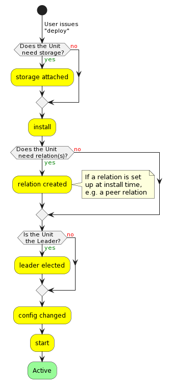

2. add-unit / scale - Command to add a Unit to an existing Application.

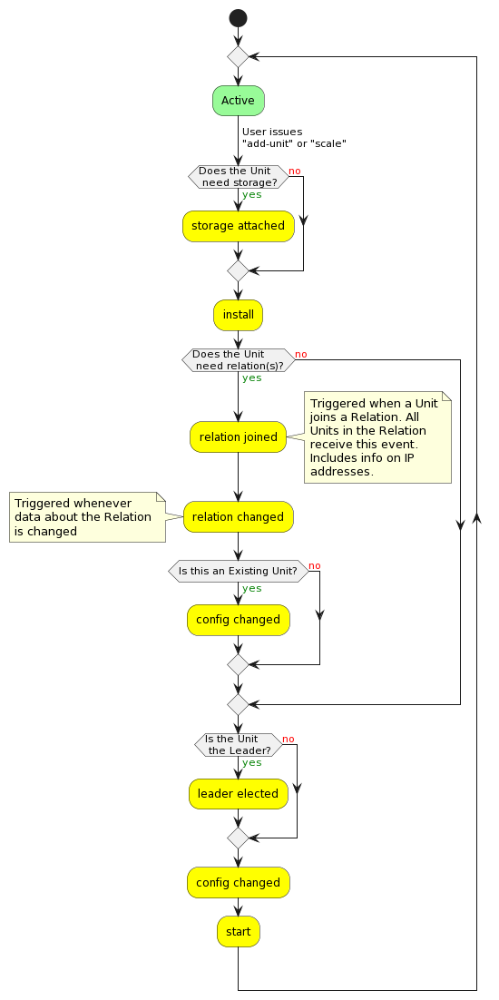

3. upgrade-charm - Command to upgrade a Charm.

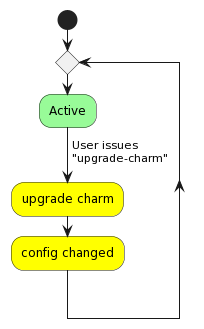

4. configure - Command to configure an existing Charm.

5. remove-unit - Command to remove a Unit for an existing Application.

6. remove-application - Command to remove an existing Application (reverse of "deploy").

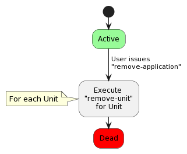

7. add-storage - Command to add storage to an existing Application.

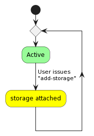

8. remove-storage - Command to remove storage from an existing Application.

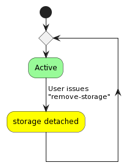

9. add-relation - Command to a Relation.

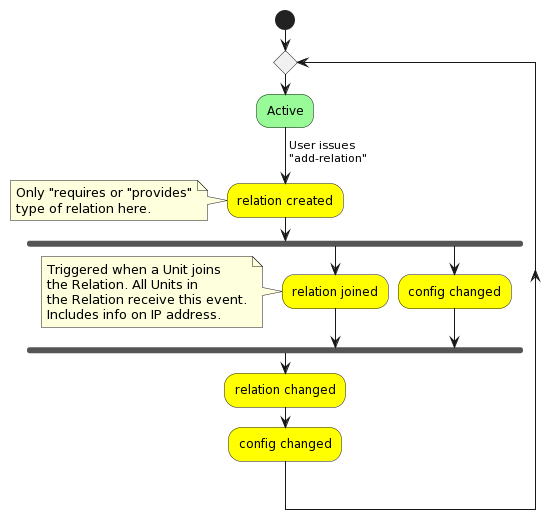

10. relate - Command to relate an Application to another.

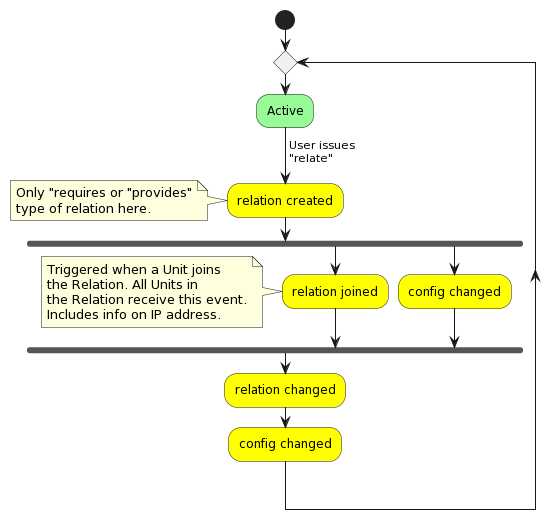

11. remove-relation - Command to remove an existing relation.

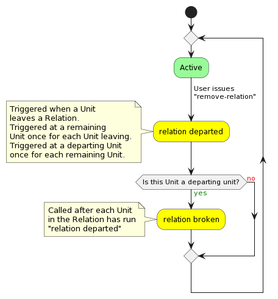

In addition, the following lifecycycle events are provided:

1. Leader election - The sequence of lifecycle events when a leader unit is elected.

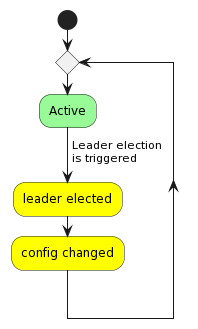

2. Set relation data - The sequence of events when data are set by another Application in the same Relation.

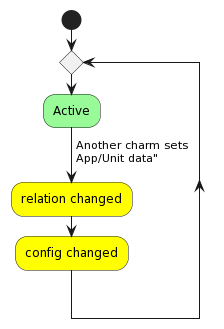
